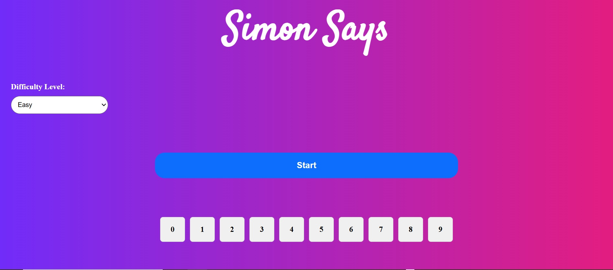
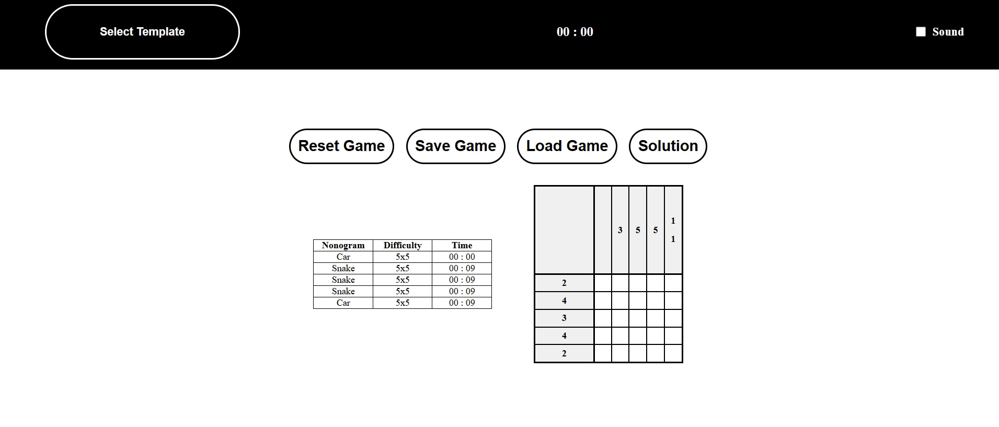
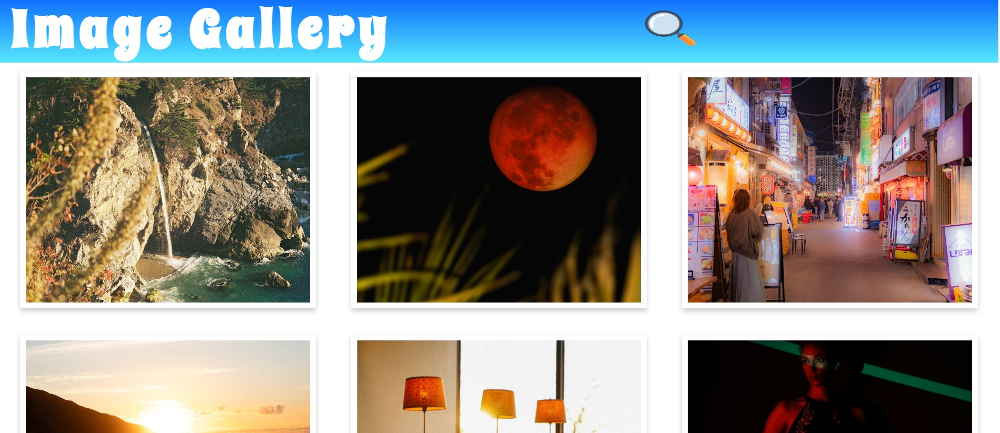
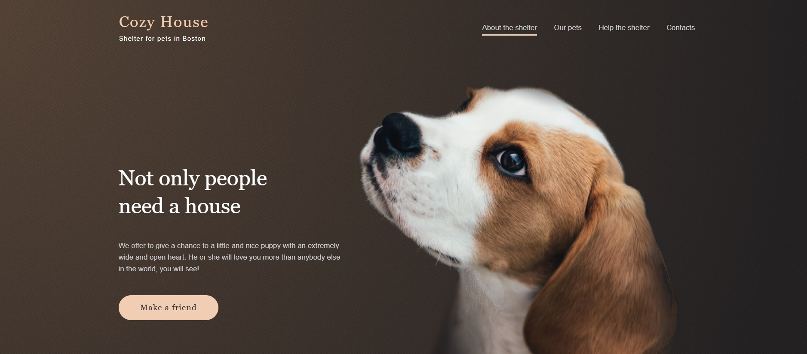
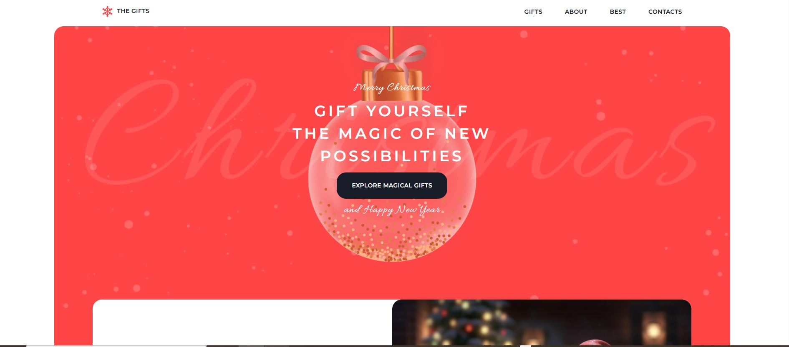

 ## 👋 Hello!

❗ My name is Jevgeni and I have a great interest in the field of web development and I hope that my desire to keep learning will help me become a demand front-end developer.
-----
**Courses:**
<table>
  <tr>
     <td>✔️</td><td></td>
  </tr>

  <tr>
    <td>✔️</td><td> </td>
  </tr>

  <tr>
    <td>✔️</td><td> </td>
  </tr>

 <tr>
 <td>✔️</td>
 <td>
  
</td>
</tr>

  <tr>
    <td>✔️</td><td> </td>
  </tr>
</table>

-----
💻  I know how it works:
-----

<section align="center">

</section>
&nbsp;

-----
🚀 My next goals are to learn REACT and MONGODB
-----

## Completed projects

 
Click image to try how it works</b>

---

<table align="center">

 <tr>
  <td>
      <a href="https://webis-2022.github.io/simon-says/" target="_blank">
       <kbd></kbd>
      </a>
   </td>
   <td>
     🎮 <b>"Simon Says"</b> the game  
   <a href="https://github.com/Webis-2022/simon-says/tree/simon-says">Link to code<a>
   </td>
  </tr>

  <tr>
  <td>
      <a href="https://rolling-scopes-school.github.io/webis-2022-JSFE2024Q4/nonograms/" target="_blank">
       <kbd></kbd>
      </a>
   </td>
   <td>
     🎮 <b>"Nonograms"</b> the game  
   <a href="https://github.com/rolling-scopes-school/webis-2022-JSFE2024Q4/tree/nonograms/nonograms/src">Link to code<a>
   </td>
  </tr>

   <tr>
    <td>
      <a href="https://rolling-scopes-school.github.io/webis-2022-JSFEPRESCHOOL2024Q2/image-gallery/" target="_blank" >
      <kbd></kbd>
      </a>
   </td>
   <td>
     📄 <b>"Image Gallery"</b> the application  
    <a href="https://github.com/rolling-scopes-school/webis-2022-JSFEPRESCHOOL2024Q2/tree/image-gallery/image-gallery">Link to code<a>
   </td>
  </tr>

  <tr>
    <td>
      <a href="https://rolling-scopes-school.github.io/webis-2022-JSFEPRESCHOOL2024Q2/shelter/" target="_blank" >
      <kbd></kbd>
      </a>
   </td>
   <td>
     📄 <b>"Shelter"</b> the website  
    <a href="https://github.com/rolling-scopes-school/webis-2022-JSFEPRESCHOOL2024Q2/tree/shelter-part3/shelter">Link to code<a>
   </td>
  </tr>

 <tr>
    <td>
       <a href="https://rolling-scopes-school.github.io/webis-2022-JSFE2024Q4/christmas-shop/" target="_blank">
       <kbd></kbd>
       </a>
   </td>
   <td>
       📄 <b>"Christmas Shop"</b> the e-store  
    <a href="https://github.com/rolling-scopes-school/webis-2022-JSFE2024Q4/tree/christmas-shop-part3/christmas-shop">Link to code<a>
      </td>
  </tr>

-->
</table>

-----

<!--
**Nilender-Andrey/Nilender-Andrey** is a ✨ _special_ ✨ repository because its `README.md` (this file) appears on your GitHub profile.

Here are some ideas to get you started:

- 🔭 I’m currently working on ...
- 🌱 I’m currently learning ...
- 👯 I’m looking to collaborate on ...
- 🤔 I’m looking for help with ...
- 💬 Ask me about ...
- 📫 How to reach me: ...
- 😄 Pronouns: ...
- ⚡ Fun fact: ...

Completed the course "ReactJS 2021" at "ItGid"
Completed the course "JavaScript / Front-end 2021" at "RS School"
-->

<!-- Архив -->
<!-- &nbsp;
&nbsp;
&nbsp;
&nbsp;
&nbsp;

&nbsp;
&nbsp;
&nbsp;
&nbsp;
&nbsp;
&nbsp; -->
